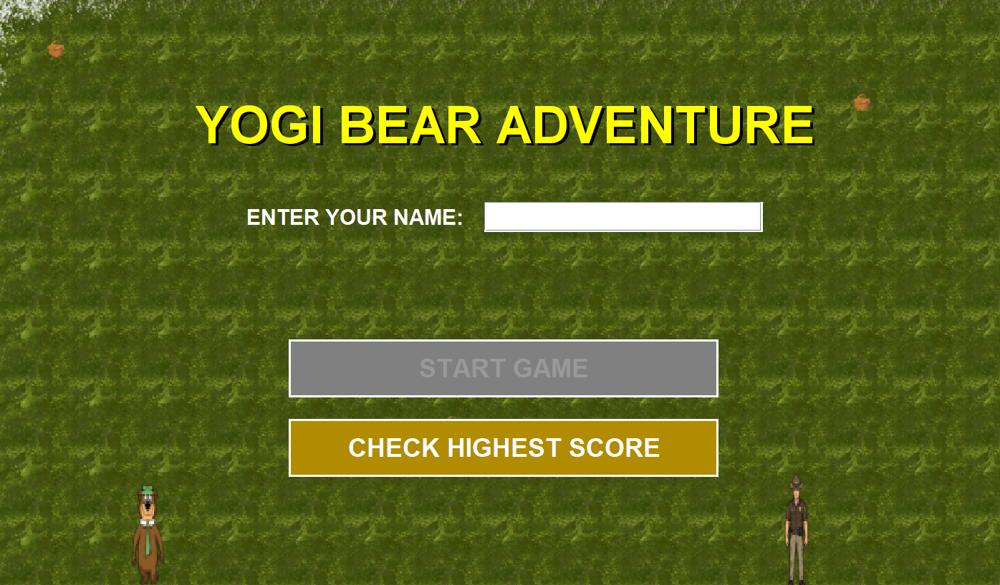
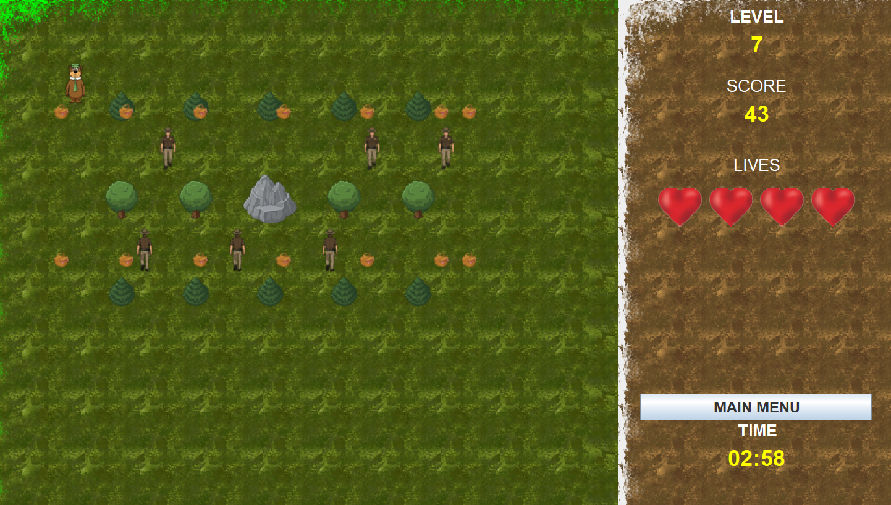

# Yogi Bear Arcade Game 🐻

A 2D, tile-based action game built with Java and Swing, featuring custom 2D rendering, grid-based movement logic, entity collision detection, and a persistent MySQL database for high scores.

## 📸 Gameplay Preview





## 🎯 Game Objective
Navigate Yogi Bear through increasingly difficult levels. Collect all picnic baskets to advance while dodging dynamically patrolling park rangers and navigating around static obstacles (trees, mountains, rocks).

## ⚙️ Technical Architecture

* **Framework:** Java SE & Java Swing (`javax.swing`, `java.awt`)
* **Game Loop:** Powered by `javax.swing.Timer` executing at ~60 FPS (16ms ticks), with throttled entity updates for optimized rendering.
* **State Management:** Externalized level loading. Game states (entities, hurdles, basket coordinates) are dynamically parsed at runtime from `.txt` files rather than hardcoded.
* **Collision Detection:** Implements Axis-Aligned Bounding Box (AABB) logic utilizing Java's `Rectangle` intersection mechanics to manage player-environment and player-enemy interactions.
* **Database Integration:** Local MySQL integration via JDBC for persistent high-score tracking across user sessions. 

## 🛠️ Tech Stack
* **Language:** Java 23 (Compiled with Azul Zulu JDK 23)
* **UI Library:** Java Swing
* **Database:** MySQL
* **Driver:** MySQL Connector/J (JDBC)

## 🚀 How to Run Locally

### Prerequisites
1. Java Development Kit (JDK) 23 installed. (Note: Running this on older LTS versions like Java 17 or 21 may result in an UnsupportedClassVersionError if not recompiled from the source code).
2. A local MySQL server running.
3. MySQL Connector/J `.jar` file included in your project dependencies.

### 🐬 Database Setup
1. Create a MySQL database named `yogi_bear_game`.
2. Create a table for scores:
   ```sql
   CREATE TABLE high_scores (
       id INT AUTO_INCREMENT PRIMARY KEY,
       name VARCHAR(50) NOT NULL,
       scores INT NOT NULL
   );
3. Create a `config.properties` file in the root directory of the project and add your credentials:
    ```properties
    db.url=jdbc:mysql://localhost:3306/yogi_bear_game
    db.user=root
    db.password=YOUR_PASSWORD_HERE
### ▶️ Execution
* Compile and run the Main.java file from your IDE, or via the command line.

### 🗺️ Project Structure Overview
* `/src/com/game/yogibear/core/` - Main game loop, state management, and backend logic.

* `/src/com/game/yogibear/ui/` - Swing Panels for menus, rendering the game board, and UI overlays.

* `/src/com/game/yogibear/entities/` - Polymorphic class structures for the Bear, Rangers, and Hurdles.

* `/src/com/game/yogibear/data/` - JDBC configuration and data persistence logic.

* `/resources/levels/` - Text files defining map layouts and entity spawn points.

* `/resources/media/` - Visual assets utilized by the AssetsLoader for the rendering loop.


## ⚙️ Key Takeaways

- 🧱 **Logic vs Rendering Separation** — `BackEnd` handles all game state; `GamePanel` only draws and captures input. Clean boundary, easier to debug.
- ⏱️ **Decoupled Update Rates** — Render loop runs at ~60 FPS via a 16ms timer; ranger movement throttled to every 8 ticks for controllable game speed.
- 🐻 **Polymorphic Entities** — Abstract `Ranger` and `Hurdle` classes allow the game loop to handle all entity types uniformly without type-checking.
- 📂 **Data-Driven Level Design** — Level layouts loaded from external `.txt` files at runtime; 30 config files across 10 levels generated via a Python script.
- 📦 **AABB Collision Detection** — Bounding box collision using Java's `Rectangle.intersects()` for efficient player-obstacle and player-enemy interaction.
- 🔒 **Secure Database Access** — JDBC with `PreparedStatement` prevents SQL injection; credentials externalized to `config.properties`, excluded from version control.